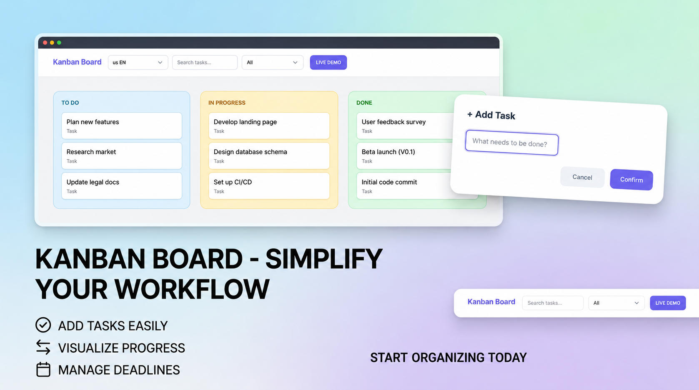

# 📋 Modern Kanban Task Manager

A high-performance, visually stunning Kanban board built with **100% Vanilla JavaScript**. This project mimics core Trello functionalities with a focus on clean code, modern UI/UX (SaaS/Notion style), and native Web APIs.

  <p align="center">
    
  </p>


## 🚀 Live Demo
[Link to your GitHub Pages or Vercel deployment]

---

## ✨ Key Features

-   **Drag & Drop Interface:** Smooth task movement between "To Do", "In Progress", and "Done" using the native HTML5 Drag and Drop API.
-   **Multi-language Support (i18n):** Real-time switching between **English (US)** and **Portuguese (BR)**.
-   **Data Persistence:** Automatic saving to `LocalStorage` so you never lose your tasks.
-   **Modern UI/UX:**
    -   Custom Notion-style Modals for Adding/Editing/Deleting.
    -   Responsive Design (Mobile-first approach).
    -   Glassmorphism and SaaS-inspired color palette.
-   **Advanced Filtering:** Search by keyword and filter by status (All, Active, Completed).
-   **Direct Interaction:** Double-click to edit, hover-to-reveal delete buttons, and intuitive task management.

---

## 🛠️ Tech Stack & Concepts

-   **HTML5:** Semantic markup for SEO and accessibility.
-   **CSS3:** Custom properties (variables), Flexbox, Grid, and complex animations.
-   **Vanilla JavaScript (ES6+):** 
    -   **DOM Manipulation:** Dynamic element creation and updates.
    -   **Event Delegation:** Optimized event listeners for better performance.
    -   **State Management:** Centralized data logic.
    -   **Internationalization (i18n):** Custom implementation for language dictionary.
-   **Web APIs:** Drag and Drop API & LocalStorage API.

---

## 📂 Project Structure

```text
src/
├── index.html      # Main structure & Modals
├── style.css       # Modern SaaS UI & Responsive layouts
├── app.js          # Core logic & State orchestration
├── storage.js      # LocalStorage abstraction
├── i18n.js         # Translation dictionary & logic
├── dragdrop.js     # Drag and Drop API implementation
└── utils.js        # Helper functions (IDs, HTML escaping)
⚙️ How to Run
Clone the repository:
code
Bash
git clone https://github.com/your-username/task-manager-kanban.git
Open the project:
Simply open src/index.html in any modern web browser.
Alternatively, use the VS Code Live Server extension for the best experience.
🧠 What I Learned
This project was a deep dive into building a full-featured application without external libraries like React or jQuery.
Handling the DOM efficiently: Learning how to re-render specific parts of the UI when the state changes.
UX Principles: Implementing custom modals to replace browser defaults (prompt, alert) for a professional feel.
Responsiveness: Managing complex layouts (Kanban columns) across different screen sizes.
🤝 Contributing
Contributions, issues, and feature requests are welcome! Feel free to check the issues page.
📝 License
This project is MIT licensed.
Developed with ❤️ by Anabelly Passos
